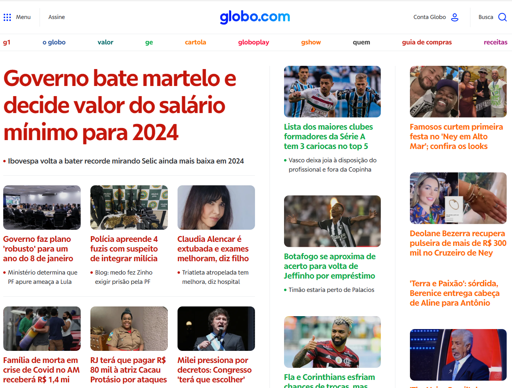

## Atividade 01 
### Nessa primeira atividade, a sua missão será copiar o layout da página do jornal a seguir de forma que a estrutura HTML aplicada possua uma boa semâtica para acessibidade.

- Imagem disponível na pasta /images

## Atividade 02
### Crie um formulário para cadastro de usuários que contenha os seguintes campos:
- Nome
- Email
- Data de nascimento
- Endereço 
- Nacionalidade
- Telefone
- Caixa de seleção com as opções: Estudante, Empregado CLT e MEI

### Para que possa fazer a requisição post crie um perfil no site https://mockapi.io/ e selecione todos os campos como texto